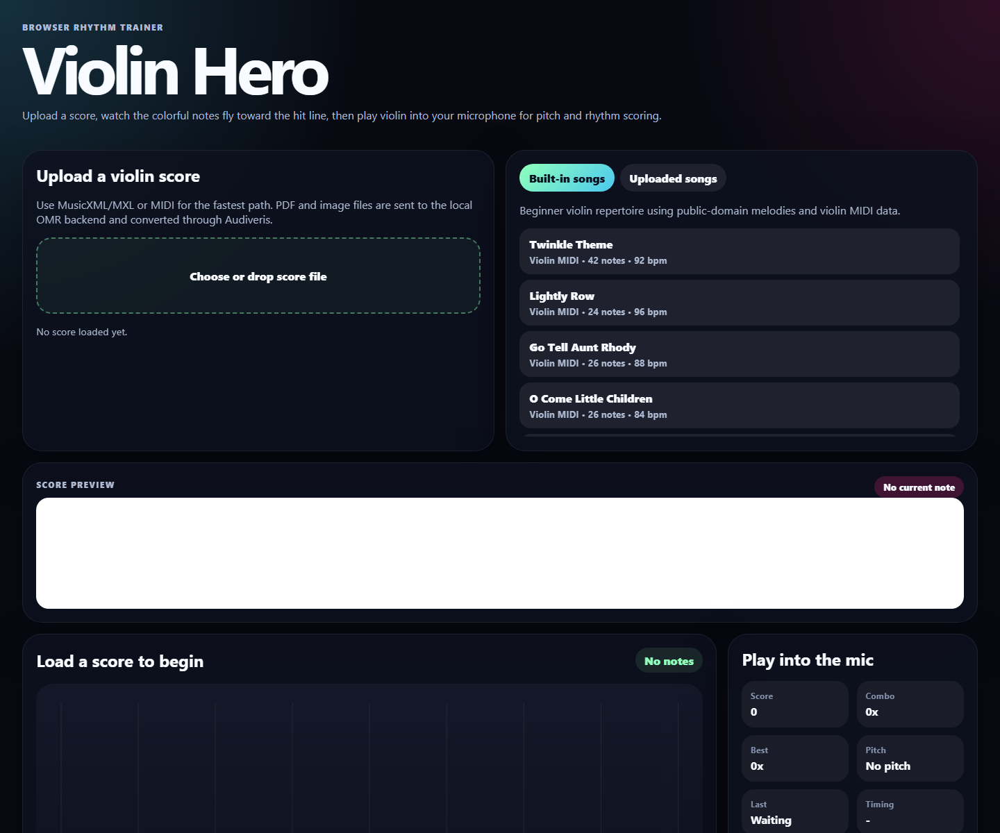

# Violin Hero

Violin Hero is a browser-based rhythm trainer inspired by Guitar Hero. Upload a violin score, watch colorful note bars move toward the hit line, and play into your microphone to receive pitch and rhythm scoring.

This README is for humans who want to run, test, or review the project. AI agents should read `AGENTS.md` before making changes.



## What Works

- MusicXML, MXL, and MIDI uploads.
- Uploaded scores are saved in the browser and can be replayed from the Uploaded songs tab.
- PDF/image uploads through a local FastAPI backend that calls Audiveris OMR.
- Low-resolution raster uploads are upscaled before OMR so screenshots have a better chance of converting.
- Built-in Suzuki Level 1 practice songs using public-domain beginner melodies and original practice patterns.
- Built-in songs are generated with General MIDI violin data for consistent playback.
- Notation preview for MusicXML/MXL, OMR results, MIDI uploads, and built-in songs.
- Demo mode that plays the loaded score with synthesized violin-like tones.
- Practice and demo playback support pause, resume, and stop controls.
- Current-note highlighting with automatic notation preview scrolling during playback.
- Canvas note highway with violin pitch range from G3 through high treble notes.
- Browser microphone pitch detection with a YIN-style detector.
- Pitch/rhythm scoring with combo, judgement, timing, and live detected pitch.

## Requirements

- Node.js 20 or newer.
- `uv` for Python dependency management.
- Python 3.11 or newer.
- Java and Audiveris for PDF/image OMR.

Audiveris must be available as `Audiveris` on `PATH`, or you can set:

```powershell
$env:AUDIVERIS_COMMAND = "C:\path\to\Audiveris.bat"
```

## Run Locally

Install frontend dependencies:

```powershell
cd frontend
npm install
npm run dev
```

In another terminal, run the backend with `uv`:

```powershell
cd backend
uv sync
uv run uvicorn app.main:app --reload --host 127.0.0.1 --port 8000
```

Open `http://127.0.0.1:5173`.

The screenshot above was captured from the local app at `http://127.0.0.1:5173` with the backend health endpoint responding at `http://127.0.0.1:8000/api/health`.

## Tests

Frontend:

```powershell
cd frontend
npm test
```

Backend:

```powershell
cd backend
uv run pytest
```

## OMR Notes

PDF and image score recognition depends heavily on scan quality, page angle, notation clarity, and Audiveris' recognition results. MusicXML/MXL or MIDI is the most reliable way to play immediately. OMR output is converted into MusicXML and then follows the same game pipeline as direct MusicXML uploads.

## Contributing

This project uses a normal pull request flow, but code must be produced by AI agents rather than hand-written by humans. See `CONTRIBUNG.md` and `AGENTS.md`.

## License

MIT. See `LICENSE`.
